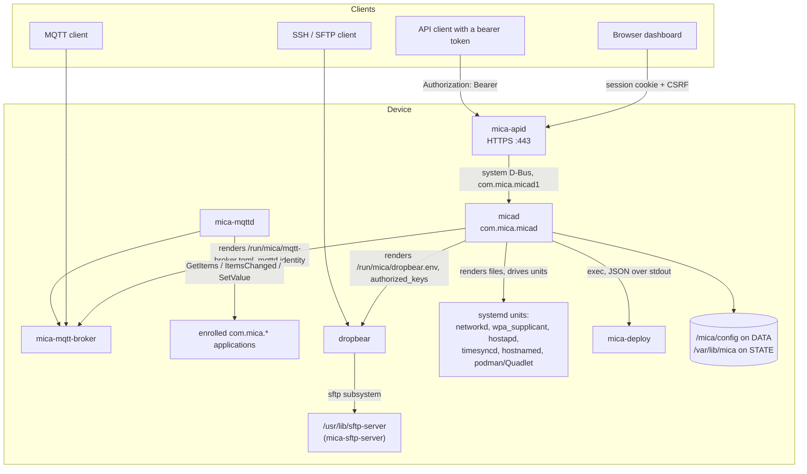
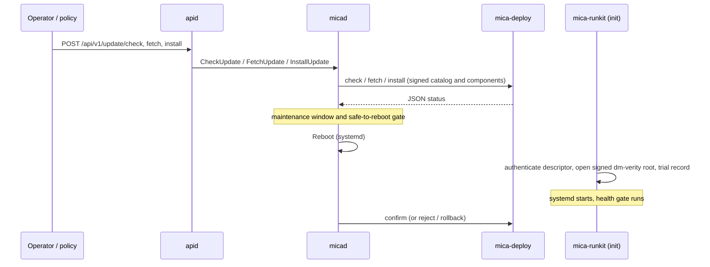

# mica-core architecture

This document explains what mica-core is, how its parts fit together on a
device, and where each concern lives in the source. The component documents
under [`design/`](design/) go one level deeper; [`development.md`](development.md)
explains how to build, test and change it.

## 1. Where mica-core sits in Mica OS

Mica OS is an embedded appliance operating system: a read-only Debian root
under systemd, verified by dm-verity, updated through signed file
deployments. mica-core is its **management plane** — the software that owns a
device's configuration, turns it into running system services, exposes it to
operators, and drives updates and early boot.

Other repositories provide the rest, and mica-core depends on them only
through packages and files on the device:

| Repository | Provides | Relationship |
| --- | --- | --- |
| `micaoss/mica-build-env` | The build images | mica-core builds inside them (`locks/mica-build-env.lock`) |
| `micaoss/mica-system-base` | The base system: Debian packages, `mica-system`, dropbear, the storage layout units | mica-core's packages depend on and run inside it |
| `micaoss/mica-podman` | The container engine | micad's container reconciler switches it on and off |
| `micaoss/mica-build` | The assembly: rootfs, kernels, signed images | imports mica-core's packages |
| `micaoss/mica-boards` | Board support | defines the boards the images target |

## 2. Runtime components



Every process above is a systemd unit. micad never supervises processes of its
own: it renders configuration and asks systemd to start, stop, restart or
reload units.

| Component | Package | Unit | Runs as | Role |
| --- | --- | --- | --- | --- |
| `micad` | `micad` | `micad.service` (`Type=dbus`) | root | Owns the settings and live-state trees, runs the reconcilers, updates, provisioning, recovery; the only writer of system configuration |
| `mica-apid` | `mica-apid` | `apid.service` | root | HTTPS API and web UI; authenticates operators and calls micad |
| `mica-mqtt-broker` | `mica-mqtt-broker` | `mica-mqtt-broker.service` | `mica-mqtt-broker` | Local MQTT 3.1.1 broker (rumqttd as a library) |
| `mica-mqttd` | `mica-mqttd` | `mica-mqttd.service` | `mica-mqttd` | Bridges enrolled application item trees to MQTT; has no access to micad |
| `sftp-server` | `mica-sftp-server` | exec'd by dropbear | the logged-in user | SFTP version 3 on stdin/stdout |
| `mica-deploy` | `mica-deploy` | invoked by micad and the boot path | root | Signed deployment acquisition, installation and boot confirmation |
| `mica-runkit` | `mica-lifecycle` | PID 1 of the initramfs and the exit ramdisk | root | Authenticated early boot and bounded shutdown |

The MQTT daemons are not enabled by their packages; micad's `mqtt` reconciler
starts them when the `mqtt` settings switch them on. `micad` and `apid` start at
boot.

## 3. The management-plane model

### 3.1 One settings tree, several documents

micad holds one typed settings tree (`crates/micad-settings`), addressed by
dot-paths such as `hostname`, `network.eth0` or `access.ssh.enabled`. Storage is
split underneath it:

- **`/mica/config/`** on DATA holds what an integrator configures, one JSON
  document per concern: `system.json`, `network.json`, `wifi.json`, `ssh.json`,
  `mqtt.json`, `time.json`, `container.json` (directory `0700`, documents
  `0600`). `updates.json` (the operator update policy) lives beside them.
- **`/var/lib/mica/`** on STATE holds what the device mints or observes about
  itself: identity, credential material and a staged reset intent
  (`settings.toml`, secrets).

Each document carries its own schema version; an unknown key or a different
version is refused, never converted. A document that does not parse disables
only the subsystems it configures; a DATA medium that does not mount stops
micad from starting at all, so a device never runs on defaults it was not
given.

### 3.2 Reconcilers

A reconciler owns one settings subtree and converges the system to it
(`crates/micad/src/reconciler/`):

```rust
trait Reconciler {
    fn name(&self) -> &'static str;      // its key in the live-state tree
    fn subtree(&self) -> &'static str;   // the settings dot-path it watches
    async fn apply(&self, settings: &Settings) -> anyhow::Result<serde_json::Value>;
}
```

| Reconciler | Subtree | System effect |
| --- | --- | --- |
| `hostname` | `hostname` | `/etc/hostname` and the running hostname |
| `network` | `network` | systemd-networkd `.network`/`.netdev` units for physical, VLAN, bridge and WireGuard interfaces; WireGuard keys generated on the device |
| `sshd` | `access.ssh` | dropbear arguments in `/run/mica/dropbear.env`, `authorized_keys` for `root` and `mica`, `dropbear.service` |
| `wifi_client` | `wifi.client` | wpa_supplicant configuration and unit, the link's networkd unit |
| `wifi_ap` | `wifi.ap` | hostapd configuration and unit, the AP's address and DHCP server |
| `container` | `container` | binds `/etc/containers/systemd` from STATE and reloads systemd so Quadlet units exist only while enabled |
| `mqtt` | `mqtt` | `/run/mica/mqtt-broker.toml`, the bridge identity, the broker and bridge units |
| `time` | `time` | timesyncd server drop-in and the presentation timezone |

A settings write is validated against the whole tree, persisted, and then
queued as an apply task (`apply_queue.rs`). The task's progress is visible as a
task record and a `TaskChanged` signal; the reconciler's result lands in the
live-state tree under its name.

### 3.3 The D-Bus interface

micad owns `com.mica.micad` on the system bus and serves interface
`com.mica.micad1` at `/com/mica/micad`. Values cross the bus as JSON strings.
The D-Bus policy (`crates/micad/dist/com.mica.micad.conf`) allows only root
to call it **and** to receive its signals, because `SettingsChanged` carries
setting values. [`design/micad.md`](design/micad.md) lists the members.

### 3.4 Live state and observation

Besides settings, micad keeps an in-memory live-state tree (reconciler
results, health reports, power actions, update progress) and read-only
observers that report what the system is actually doing: network links,
time synchronisation, storage tiers and quotas, system information, board
telemetry and failure evidence. Observers are traits with an "unavailable"
default, so a test or dry-run daemon never inspects its host.

## 4. Access

- **HTTPS API and dashboard** (`mica-apid`). First-run setup sets the admin
  password; browsers then authenticate into an HMAC-signed, HttpOnly session
  cookie and send a CSRF token on mutations; automation uses bearer API tokens
  stored as digests. Login attempts are rate-limited with persistent backoff,
  and security-relevant actions go to an audit ring. TLS uses a self-signed
  certificate generated on first start. See [`design/apid.md`](design/apid.md).
- **SSH and SFTP.** dropbear is configured solely by micad's `sshd` reconciler:
  listen addresses, and the authorized keys of the managed accounts `root` and
  `mica`. It is off unless `access.ssh` enables it. dropbear runs
  `/usr/lib/sftp-server` for the `sftp` subsystem; the server does no privilege
  handling, so a session can touch exactly what that account can in a shell.
  A transient root password can be set once and is gone on the next boot.
- **MQTT** carries application data only. See [`design/mqtt.md`](design/mqtt.md).
- **Physical recovery.** A board-declared recovery action at boot maps to a
  reset tier: configuration, application data, or full factory state.

## 5. Updates and boot



- **mica-deploy** keeps at most two signed deployments on SYSTEM. It verifies
  the signed catalog and component contracts against embedded public keys,
  streams component archives into DATA, installs under a transaction lock with
  capacity and generation checks, and writes UEFI or U-Boot trial boot records.
  Firmware maintenance uses separate signed manifests; no deployment can carry
  firmware.
- **micad** wraps it with policy: automatic check cadence, the maintenance
  window, a safe-to-reboot gate with a bounded administrative override, failed
  deployment IDs and generation floors that stop a rejected release from
  reinstalling.
- **mica-runkit** is PID 1 twice: as `init` in the signed initramfs it
  authenticates the selected deployment, opens the signed dm-verity root and
  support mappings, binds modules and firmware and establishes persistent
  identity before systemd; as `shutdown` in a memory-only exit ramdisk it
  releases loops and mappings before their backing filesystems.

See [`design/deployment.md`](design/deployment.md).

## 6. Security boundaries

| Boundary | Enforced by |
| --- | --- |
| Only root manages the device over D-Bus | micad's bus policy denies send and receive to everyone else |
| Network clients reach management only through apid | apid authenticates every `/api` request; micad has no network listener |
| MQTT cannot reach management | mica-mqttd has no D-Bus access to micad; only package-enrolled `com.mica.*` application names are bridged |
| Secrets stay on the device | WireGuard and credential keys are generated on the device and never enter the settings tree; `/mica/config` is `0700` |
| What runs is what was signed | dm-verity root, signed deployment metadata, native trial records confirmed only by the health path |
| Daemons are confined | systemd sandboxing in each unit (`NoNewPrivileges`, `ProtectSystem=strict` for apid, dedicated users for the MQTT daemons); `unsafe` is forbidden in every crate but `lifecycle-sys` |

## 7. Build and delivery

Everything is built inside the images named by `locks/mica-build-env.lock` and packed
by this repository's own scripts:


See [`design/packaging-and-release.md`](design/packaging-and-release.md).

## 8. Source map

| Concern | Where |
| --- | --- |
| Daemon entry, environment, startup order | `crates/micad/src/lib.rs` |
| D-Bus interface | `crates/micad/src/bus.rs` |
| Reconcilers | `crates/micad/src/reconciler/` |
| Settings model and storage | `crates/micad-settings/src/` |
| Provisioning, identity, recovery, reset | `crates/micad/src/{provisioning,provisioning_doc,identity,recovery,reset}.rs` |
| Update policy and lifecycle | `crates/micad/src/update_*.rs`, `deployment.rs` |
| HTTP API, auth, UI bundles | `crates/mica-apid/src/` |
| Web UI | `crates/mica-apid/ui/` |
| MQTT bridge and broker | `crates/mica-mqttd/`, `crates/mica-mqtt-broker/` |
| SFTP server | `crates/mica-sftp-server/` |
| Deployments and early boot | `crates/mica-deploy/`, `crates/lifecycle-sys/` |
| Units and D-Bus policy | `crates/*/dist/` |
| Packaging | `pkgs/`, `scripts/deb/`, `scripts/build/build-deb.sh` |
| Gates | `scripts/gate/`, `scripts/build/check.sh` |
| CI and release | `.github/workflows/`, `scripts/build/release.sh` |
