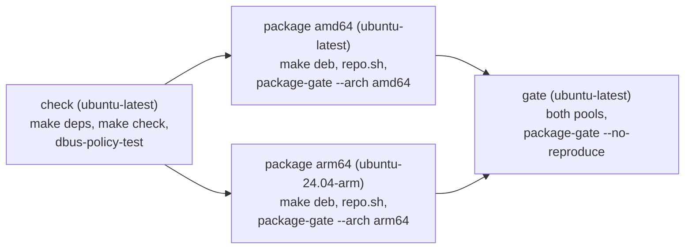

# Packaging and release

How source in `crates/` becomes the Debian packages of a release, and what is
checked on the way.

## 1. Inputs

The inputs live in `locks/`, in the format of `mica:docs/design/release-lock.md`
(section 4):

- `locks/mica-build-env.lock` is the lock asset of a `micaoss/mica-build-env`
  release, committed byte for byte, and `locks/pins/mica-build-env.pin` records
  that release's tag and the sha256 of its `SHA256SUMS`;
- `locks/upstream.lock` holds this repository's own third-party pins. It has
  none: `Cargo.lock` and `bun.lock` pin the language dependencies, and every
  third-party image comes from the `upstream` rows of
  `locks/mica-build-env.lock`.

- `make deps-check` (`scripts/build/locks.sh check`) applies the file rules of
  every lock and pin offline (`scripts/build/check-lock.sh`); an offline pin is
  refused under CI.
- `make deps` (`scripts/build/locks.sh verify`) also downloads each pinned
  release's `SHA256SUMS` anonymously and refuses the lock unless `SHA256SUMS`
  hashes to the pin, lists exactly the lock, and names its sha256.
- `scripts/build/from.sh --ref <image>` resolves a `mica-build-env` image to its
  index (or, with `--arch`, its platform manifest) by digest;
  `--upstream <name>` resolves a third-party image by its original name.

| Image | Used for |
| --- | --- |
| `rust` | Compiling every crate (rustc, clippy, rustfmt, cargo-nextest, cargo-deny, dbus-daemon, C toolchains for both architectures) |
| `base` | Building the web UI (Bun), packing archives (dpkg-dev), indexing pools, the package gate |
| `upstream moby/buildkit:v0.33.0` | The container builders `scripts/deb/build.sh` and the package gate create |
| `upstream docker/dockerfile:1` | The Dockerfile frontend of every producer (`BUILDKIT_SYNTAX`) |

Moving to another release replaces the lock and its pin together.

## 2. Producers

A producer is a directory under `pkgs/` (`pkgs/README.md` is the contract):
`producer.env` (`PACKAGES`, `ENABLEMENT`, `CONTEXTS`), `prepare.sh`,
`Dockerfile` and one `control/<package>.control` per package.

| Producer | Packages | Compiles |
| --- | --- | --- |
| `micad` | `micad` | `micad` |
| `apid` | `mica-apid` | `mica-apid` (with the built UI) and its OpenAPI document |
| `mqtt` | `mica-mqttd`, `mica-mqtt-broker` | both binaries |
| `sftp` | `mica-sftp-server` | `mica-sftp-server` |
| `deploy` | `mica-deploy` | `mica-deploy` |
| `lifecycle` | `mica-lifecycle` | `mica-runkit`, statically linked |

`scripts/deb/build.sh --producer 
 --arch <arch>` runs the producer's
`prepare.sh`, which calls `scripts/build/build-deb.sh`:

1. compile only the producer's binaries (`cargo build --release --locked
   --target <triple> --bin ...`) in the Rust image of the **host's**
   architecture — native on an arm64 runner, a cargo cross-compile otherwise,
   never emulation;
2. fail if the producer's private target directory
   (`_out/target-deb/<producer>/`) holds any binary the producer does not own;
3. check each binary's ELF architecture (and, for `mica-runkit`, that it is
   truly static) and stage it.

`build.sh` then runs the producer's `Dockerfile` in the base image **of the
target architecture**, because `dpkg-shlibdeps` resolves dependencies against
the libraries of the container it runs in. The Dockerfile stages files and calls
`scripts/deb/pack.sh`, which sets every mtime to `SOURCE_DATE_EPOCH`, owns
everything by root, and writes `Installed-Size`, `md5sums` and
`Mica-Source-Repo`. Archives land in `_out/debs/<arch>/pool/`; `build.sh`
records the producer's inputs hash (`scripts/deb/inputs.sh`) in
`_out/debs/<arch>/inputs.tsv`, and `scripts/deb/repo.sh` indexes a pool.

Versions follow `mica:docs/decisions/2026-09-15-package-versions.md`. Each
producer declares `VERSION="<upstream>-<revision>"` and `SOURCE_DATE_EPOCH` in
its `producer.env`; the upstream part is the crate version of the binaries it
ships, compiled into them as the version `--version` and micad's system
information report. A release never changes a version and nothing in a package
names a commit, so a package's bytes change only with its version:

- **Bump.** A packaging-only change bumps the revision; a source change bumps
  the crate version and the upstream part and resets the revision. A `micad`
  bump bumps the revision of `mica-apid`, `mica-mqttd` and `mica-mqtt-broker`,
  which depend on its exact version.
- **Guard.** `scripts/build/reuse.sh` reads, anonymously, the lock and pools of
  the newest release whose pool layers carry `mica.inputs` (a release made
  before these rules carries none and is passed over; with none, every package
  is new). A package at its released version must have the same inputs hash
  (the pool layer's `mica.inputs`) and rebuild to the same sha256, else it is
  refused ("inputs of <package> changed without a version bump", or a
  byte-identical rebuild is required); a higher version is new; a lower one is
  refused. `ci.yml` runs it read-only and the release runs it before pushing.
  The inputs are the producer's tracked files, the crates its binaries depend
  on (test trees aside), the workspace manifest and lock, the packing tooling
  and the architecture; the build-env images are not inputs, since the
  byte-identical rebuild catches a toolchain that changes bytes.

## 3. Gates

| Gate | Command | Checks |
| --- | --- | --- |
| Lint | `make lint` | Shell hygiene, including no early-exiting `grep -q` under `pipefail` |
| Locks | `make locks-test` | The release lock specification's vectors (lock, upstream and pin rules), `locks.sh verify` against fixture releases (trust hash, altered lock, extra entries, missing release), offline pins under CI, `from.sh` |
| Release publisher | `make release-test` | `scripts/build/release.sh` against a fake release and a fake registry: both pools, the lock (checked valid), rerun, re-pointed tag, private package, every refusal |
| UI build contract | `make apid-ui-build-contract-test` | The UI builds as ignored production assets in the base image |
| Rust gate | `make rust-gate` | `scripts/build/check.sh` in the Rust image: crate versions equal `VERSION`, `cargo fmt --check`, `clippy -D warnings`, nextest, doctests, `cargo deny` (licenses, bans, advisories), and the committed OpenAPI document equals `mica-apid --openapi` |
| Boot/shutdown | `make boot-shutdown-test` | The shutdown suite and the lifecycle UAPI translation unit (`BOOT_SHUTDOWN_ARM_ABI=1` adds aarch64) |
| IO faults | `make file-transaction-faults` | mica-deploy's transactions interrupted before and after each observed IO |
| D-Bus policy | `make dbus-policy-test` (root, host `dbus-daemon`) | The shipped micad policy against a real bus: root may call and receive, others may neither |
| Package gate | `scripts/deb/package-gate.sh` | Below |

`make check` runs lint, both loader and publisher tests, the UI contract, the
Rust gate, boot/shutdown and IO faults.

The package gate reads the archives with `dpkg-deb` in the base image and
checks, per architecture: the pool holds exactly the declared packages, each of
that architecture and all with one git stamp; no `Replaces` and no path shipped
by two packages; a dependency on a package built here names its exact pool
version; a non-empty copyright file per package; enablement links equal to
`ENABLEMENT`; no conffiles; maintainer scripts that parse as POSIX sh; and that a
rebuild of one producer on an empty-cache builder is byte-identical. `--arch <a>`
gates one architecture; `--no-reproduce` skips the rebuild for a job gating pools
another job already reproduced.

## 4. CI

`.github/workflows/build.yml` is shared:

- `ci.yml` runs it on every push to `main` and every pull request, except when
  only `docs/` or markdown changed, and by hand (`gh workflow run ci.yml --ref
  main`). It publishes nothing.
- `release.yml` runs it for a published release (below).

Every job restores a cache of third-party cargo artifacts, the cargo registry
and the bun package cache, keyed by `locks/mica-build-env.lock`, `Cargo.lock`, the
Cargo manifests and `bun.lock`; a change to any of them misses. Only a push to
`main` saves, after `scripts/build/cache-prune.sh` removes everything the
workspace's own crates produced, so every workspace crate still compiles from
source and every gate, including the byte-identical rebuild, still runs.
Pull request and release runs only read what `main` wrote. A package built
from that cache is byte-identical to one built from an empty target directory.

## 5. Releases

A release is named for its UTC time, `YYYYMMDD-HHMM`, with no `v` prefix. Tags
are never created locally.

1. Cut the release on a commit of `main`:
   `gh release create <YYYYMMDD-HHMM> --target <commit>`.
2. `release.yml` fires on `release: published`, runs `build.yml` on the tag,
   gates the downloaded archives again, and runs
   `scripts/build/release.sh <tag>`.
3. `release.sh` checks the checkout is clean, on `origin/main`, and named by the
   tag; checks every archive (package set, architecture, declared version,
   source repository, no commit); runs `scripts/build/reuse.sh` against the
   previous release; then:
   - pushes the pools `ghcr.io/micaoss/mica-core:pool.<arch>.<tag>` through the
     registry API with the workflow's token (`packages: write`): one OCI
     manifest per architecture, artifact type `application/vnd.mica.pool`, an
     empty config, one layer per archive (media type `application/vnd.mica.deb`,
     `org.opencontainers.image.title` the file name with its real `+`, and
     `mica.inputs` the producer's inputs hash), and only the release-independent
     manifest annotations `mica.source-repo` and `mica.arch`, so a pool whose
     packages did not change is the same manifest under the release's new tag.
     A tag that already holds another
     manifest is refused; each manifest and every layer are read back with no
     credential;
   - writes `mica-core.lock`: the release row, `pool amd64` and `pool arm64` by
     digest, and one `package` row per archive and architecture (name, arch,
     version, sha256), sorted as the specification orders them, and refuses it
     unless `scripts/build/check-lock.sh` finds it valid;
   - uploads `mica-core.lock`, then `SHA256SUMS` listing only it, refuses to
     replace either with other bytes and refuses a release carrying any other
     asset; then downloads both back without credentials and compares them.

GHCR creates the `mica-core` package private on its first push and has no API
to change that; the first release stops at the anonymous read until the package
is made public in its settings, and rerunning the publish job then completes it.

A consumer commits `mica-core.lock` as `locks/mica-core.lock` with a pin
recording the release and the sha256 of its `SHA256SUMS`, and takes each
archive as the layer of `pool <arch>` whose digest is the package row's
sha256.
